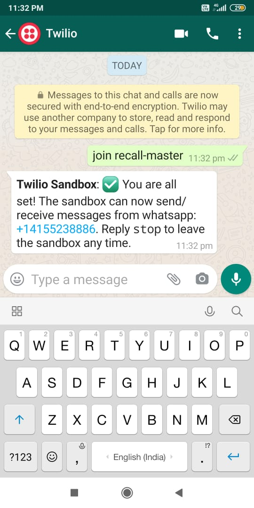
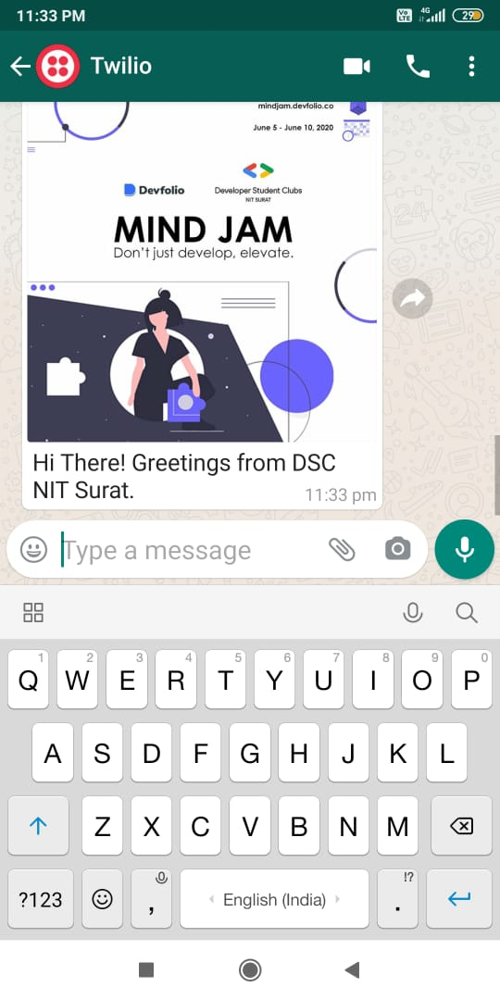

# Publicize
It often occurs that whenever a club/student chapter wants to notify all the students of college, they heavily rely on their executives to publicize the event notification/message on different platforms like WhatsApp, Instagram, Discord, Slack, etc. 
Usually it happens that many executives fails to send the message or even read the message. It becomes difficult for the Core team/Organizers to make everyone aware of the event. Also, most of the people don't tend to open other apps except WhatsApp and they miss out on the notifications which leads to low attendance in the event. WhatsApp is something which everyone opens atleast once in 2 hours. 
What we have thought is of receiving WhatsApp message of the EVENTS of clubs/student chapters which the students opts for. 
It makes it much more convenient for the organizers to send the event message which includes text and images from a single channel on WhatsApp. Instead of relying on someone else to propagate the message, it will be easier to know many people are receiving the message.

## Workflow

1. Students of a college need to Sign Up on our website. There they can choose the clubs that they are interested in and want to receive notifications.
    
  
  
2. Then they need to add a number - +1(415)523-8886 and save it as any name they wish to call the service.. for eg.. SVNIT Event Notification by ... 

    

2. The different clubs of a college need to register first to use our features.

    
    

3. This is the dashboard of the Logged In club from where they can send notifications.

    
  

4. We have added a feature wherein you can upload an image on your Google Drive from the site itself.

    

5. Users can enter the google drive link or any other link which provides the required image in the textbox below.

    

6. After filling all the details of the message and sending it, the users will receive the message as shown below.
    

